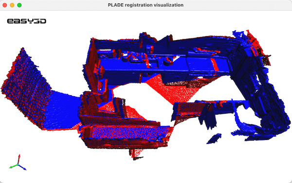

### PLADE: A Plane-based Descriptor for Point Cloud Registration with Small Overlap



This repository contains implementation of the point cloud registration method described in 

```bibtex
@article{chen2019plade,
  title={PLADE: A plane-based descriptor for point cloud registration with small overlap},
  author={Chen, Songlin and Nan, Liangliang and Xia, Renbo and Zhao, Jibin and Wonka, Peter},
  journal={IEEE Transactions on Geoscience and Remote Sensing},
  volume={58},
  number={4},
  pages={2530--2540},
  year={2019},
  publisher={IEEE}
}
```

### PLADE repository layout
The repository contains a `CMakeLists.txt` file (in the root directory of the repository) that serves as an anchor for
configuring and building programs, and a set of subfolders:
* [`code`](https://github.com/chsl/PLADE/tree/master/code) - source code of PLADE implementation.
* [`sample_data`](https://github.com/chsl/PLADE/tree/master/sample_data) - two pairs of test point clouds.

### Build PLADE

PLADE depends on [boost](https://www.boost.org/). Please install [boost](https://www.boost.org/) first.

To build PLADE, you need [CMake](https://cmake.org/download/) (`>= 3.12`) and, of course, a compiler that supports `>= C++11`. The code in this repository has been tested on macOS (Xcode >= 8), Windows (MSVC >=2015 `x64`), and Linux (GCC >= 4.8, Clang >= 3.3). Machines
nowadays typically provide higher [support](https://en.cppreference.com/w/cpp/compiler_support), so you should be able
to build PLADE on almost all platforms.

There are many options to build PLADE. Choose one of the following (not an exhaustive list):

- Option 1 (purely on the command line): Use CMake to generate Makefiles and then `make` (on Linux/macOS) or `nmake`(on Windows with Microsoft
  Visual Studio).
    - On Linux or macOS, you can simply
      ```
          $ cd path-to-root-dir-of-PLADE
          $ mkdir Release
          $ cd Release
          $ cmake -DCMAKE_BUILD_TYPE=Release ..
          $ make
      ```
    - On Windows with Microsoft Visual Studio, use the `x64 Native Tools Command Prompt for VS XXXX` (**don't** use the x86 one), then
      ```
          $ cd path-to-root-dir-of-PLADE
          $ mkdir Release
          $ cd Release
          $ cmake -G "NMake Makefiles" -DCMAKE_BUILD_TYPE=Release ..
          $ nmake
      ```

- Option 2: Use any IDE that can directly handle CMakeLists files to open the `CMakeLists.txt` in the **root** directory of
  PLADE. Then you should have obtained a usable project and just build it. I recommend using
  [CLion](https://www.jetbrains.com/clion/) or [QtCreator](https://www.qt.io/product). For Windows users: your IDE must be set for `x64`.

- Option 3: Use CMake-Gui to generate project files for your IDE. Then load the project to your IDE and build it. For Windows users: your IDE must be set for `x64`.

Don't have any experience with C/C++ programming?
Have a look at <a href="https://github.com/LiangliangNan/Easy3D/blob/main/HowToBuild.md">How to build PLADE step by
step</a>.


### Test Dataset

[RESSO: Real-world Scans with Small Overlap](https://3d.bk.tudelft.nl/liangliang/publications/2019/plade/resso.html).
This dataset is part of the PLADE work.

**---> Attention <---** 

This implementation requires that the input point clouds have oriented normals for faster convergency. Actually, this requirement can be relieved by allowing a plane (a group of 3D points) to have two opposite orientations. This way, more descriptors (consisdering both orientations of each plane) will be generated and matched. This is slow but can be very useful in practice. As for the demo purpose, the code in this repository does not implement it and thus the user should provide oriented point normals.

### Citation
If you use PLADE or the [RESSO](https://3d.bk.tudelft.nl/liangliang/publications/2019/plade/resso.html) dataset in scientific work, I kindly ask you to cite it:

```bibtex
@article{chen2019plade,
  title={PLADE: A plane-based descriptor for point cloud registration with small overlap},
  author={Chen, Songlin and Nan, Liangliang and Xia, Renbo and Zhao, Jibin and Wonka, Peter},
  journal={IEEE Transactions on Geoscience and Remote Sensing},
  volume={58},
  number={4},
  pages={2530--2540},
  year={2019},
  publisher={IEEE}
}
```
---------

Should you have any questions, comments, or suggestions, please raise an [issue](https://github.com/chsl/PLADE/issues).
